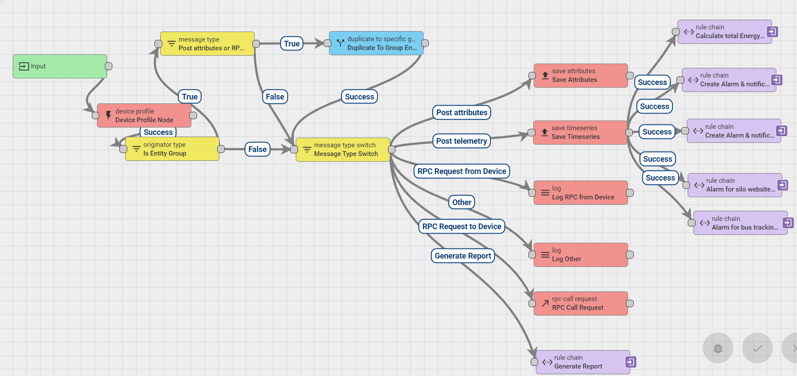

# Smart-farming-dashboard-ThingsBoard
## Smart farming and smart agriculture solutions

## Overview

ThingsBoard platform provides out-of-the-box components and APIs to dramatically reduce time to market and your effort to develop smart farming solutions and projects. The platform is device-agnostic, so you can feed and analyze the data from any sensor, connected device or application. Save up to 90% of development time for your smart farming project by utilizing following benefits:

a. Reliable and fault-tolerant data collection from your IoT devices and sensors to monitor facilities state, crop growth characteristics, humidity level, etc.;

b. Advanced and flexible data visualization for real-time and historical monitoring of future farms;

c. Customizable end-user dashboards to share farm monitoring results;

d. Integration with third-party analytics frameworks and solutions for advanced analytics and machine learning;

e. Optimize returns on inputs while preserving resources by remotely configuring IoT devices based on results of the analytics.

f. The platform provides production ready server infrastructure to connect your IoT devices, store and analyze collected IoT data, optimizing returns on inputs and resources.

## Generate random values use ThingsBoard rule chains,

## Root rule chain,

I use root rule chain to sending data to the Latest telemetry.

## Alarm and Notification

I also created alarm and notification for demo dashboard using ThingsBoard rule chains.

## Random values example,

  
## Smart Farming Dashboard

Live Demo: [Smart Farming Dashboard](https://myiot.polisea.ro/dashboard/5d8810b0-057a-11ec-9fc0-d7ec4e17a89a?publicId=7cb71a20-041d-11ec-9fc0-d7ec4e17a89a)

Visit our official website: [Polisea S.A](https://polisea.ro/aiot/) 

🚩 Connect with me on social
- LinkedIn: [LinkedIn](https://www.linkedin.com/in/ariful-islam-arif-2987b51a3/)
- Twitter: [Twitter](https://twitter.com/arifulislam301)
- Instagram: [Instagram](https://www.instagram.com/ariful_mr_islam/)

🔔 Subscribe to my YouTube channel: [YouTube](https://www.youtube.com/channel/UCED68cm6nHaAlAk0h9I3yAQ)
